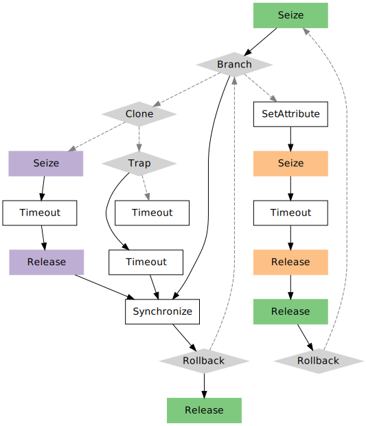

```{r, echo = FALSE, message = FALSE}
knitr::opts_chunk$set(collapse = T, comment = "#>", 
                      fig.width = 6, fig.height = 8, fig.align = "center")
```

Simulation trajectories may grow considerably, and they are not always easy to inspect to ensure their compliance with the model that we are trying to build. For instance, let us consider this pretty complex one:

```{r, message=FALSE}
library(simmer)

t0 <- trajectory() %>%
  seize("res0", 1) %>%
  branch(function() 1, c(TRUE, FALSE),
         trajectory() %>%
           clone(2,
                 trajectory() %>%
                   seize("res1", 1) %>%
                   timeout(1) %>%
                   release("res1", 1),
                 trajectory() %>%
                   trap("signal",
                        handler=trajectory() %>%
                          timeout(1)) %>%
                   timeout(1)),
         trajectory() %>%
           set_attribute("dummy", 1) %>%
           seize("res2", function() 1) %>%
           timeout(function() rnorm(1, 20)) %>%
           release("res2", function() 1) %>%
           release("res0", 1) %>%
           rollback(11)) %>%
  synchronize() %>%
  rollback(2) %>%
  release("res0", 1)
```

We must ensure that:

- Resources are seized and released as we expect.
- Branches end (or continue) where we expect.
- Rollbacks point back to the activity we expect.
- ...

For this task, the **simmer.plot** package provides an S3 method for the `plot` generic to visualise diagrams of trajectory objects (see `?plot.trajectory` for more details) using the `DiagrammeR` package as the backend, which facilitates trajectory checking and debugging.

Note that colors are assigned to seizes and releases as a function of the resource that these are applied to. By default, resources are mapped to a qualitative Color Brewer palette, but you can override this using the optional parameter `fill`.

```{r, eval=FALSE}
library(simmer.plot)

get_palette <- scales::brewer_pal(type = "qual", palette = 1)
plot(t0, fill = get_palette)
```


